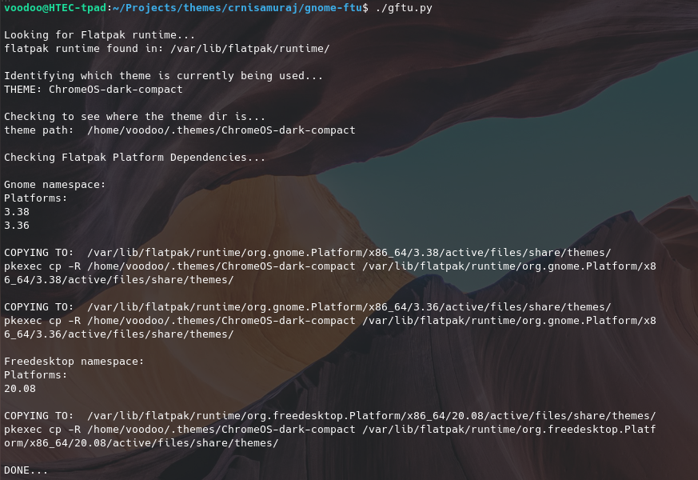

# Gnome Flatpak Custom Theme Updater
forked from: @hkdb
maintained by: @crnisamuraj



### SUMMARY

If you do what I do as described [here](https://medium.com/@hkdb/custom-gtk3-theme-for-flatpak-6d2c216e1496) to sync your custom theme with Flatpak apps, everytime your flatpak apps get updated, your theme folder gets deleted from the flapak Gnome runtime folder and your flatpak apps go back to the default theme that's out of sync with what you are using in Gnome. Here's a quick script to sync your custom theme with flatpak apps after they get updated to make it a little easier.

#### CHANGES IN THIS FORK
This fork is modified to look for themes additionali in ~/.themes/ folder and to look for Flatpak runtime in /var/lib/flatpak/runtime/ (sys instalation). In order to copy files to /var/lib/flatpak/ root permission is required, so pkexec is being used to elevate cp command execution.

### DEPENDENCIES

- Flatpak runtime
- Python 3.x

### USAGE

1. `git clone git@github.com:crnisamuraj/gnome-ftu.git`
2. `cd gnome-ftu`
3. `./gftu.py`

If you want to make things easier and execute this globally inside your terminal, you can do the following to alias it:

```
cd ~/.local/share/
git clone git@github.com:hkdb/gnome-ftu.git
echo "alias gftu='~/.local/share/gnome-ftu/gftu.py'" >> ~/.bash_aliases
exit
```
The next time you open up your terminal, you can just type `gftu` anywhere and it will do what it's supposed to do.

### DISCLAIMER
This repo is maintained by volunteers, and in no way make any guarantees. Please use at your own risk!

